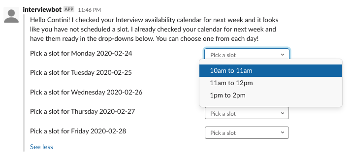

# interview-scheduler-slackbot 🤖

## What does this bot do?

Makes scheduling interview slots for the coming week super easy. Pull out your phone, look at the client calendar and pick a slot, the bot will create the event on the Interview Availability calendar 🤯. The bot will make sure the suggested slots are from your free time.

## Setup local google calendar dev environment

Follow below guide and install required tools for python dev environment

https://developers.google.com/calendar/quickstart/python

Interview availability calendar id
`contino.io_eepahmdv2bb1tvhbvv0ictha3g@group.calendar.google.com`

## Tasks (✅ indicate completed, 👩‍💻 indicates in progress)

Get current date ✅

Generate next week's dates ✅

List Slack Users ✅

Get Slack User's name ✅

Get Slack User's email ✅

Get Slack User's DM ID ✅

DM User ✅

Generate BotKit message with buttons and deliver payload ✅

Read Contino interview availability calendar ✅

Read specific user's calendar for above dates ✅

Get Busy events from user's calendar on specific day ✅

Identify free slots in their calendar that span 1 hour from above day (avoid lunch time 👩‍💻) ✅

Use slots fetched to build message for individual user ✅

Deliver payload to user's direct message channel ✅

Capture user response json (button click) 👩‍💻

Build payload for google calendar

Make api call to google calendar to create event/s

## Sample message delivered to user



## Sample json payload received after user clicks on option

```
  "actions": [
    {
      "type": "static_select",
      "action_id": "ashok.gadepalli@contino.io_UTU6JPJG6",
      "block_id": "=S=o",
      "selected_option": {
        "text": {
          "type": "plain_text",
          "text": "11:00:00 - 12:00:00",
          "emoji": true
        },
        "value": "2020-02-24T11:00:00-06:00"
      },
      "placeholder": {
        "type": "plain_text",
        "text": "Select a slot",
        "emoji": true
      },
      "action_ts": "1582174391.004828"
    }
  ]
}
```
