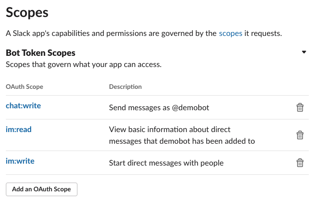
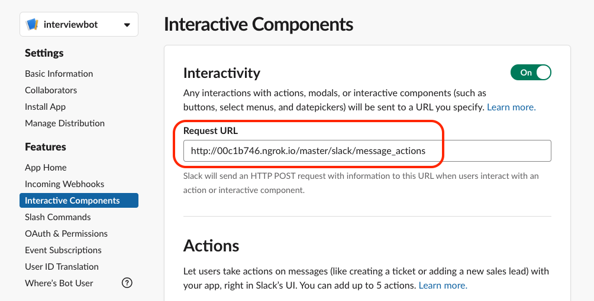

# interview-scheduler-slackbot 🤖

## What does this bot do?

Makes scheduling interview slots for the coming week super easy. Pull out your phone, look at the client calendar and pick a slot, the bot will create the event on the Interview Availability calendar 🤯. The bot will make sure the suggested slots are from your free time.

# Installation

You need four things to run the slackbot locally:

1) Your own Slack Workspace for bot development

2) A Slack app in the workspace created above

3) [ngrok](https://ngrok.com/download)

🛑 If you just want to play with a slackbot, finish the steps above and use this [repo](https://github.com/ashokgadeking/python-message-menu-example/tree/blocks_messages) instead.

4) Google Calendar API credentials

## Create a Slack workspace

Click on the link below and use your personal personal email address (not Contino email!) to create a development workspace. Setting up the workspace should be super straight-forward.

https://slack.com/create#email

https://slack.com/help/articles/206845317-Create-a-Slack-workspace

## Configure Slack App on the Slack API console

1) Once you are done setting up the workspace, head over to https://api.slack.com/apps and click on create a new app.

2) Next, enable interactive components. This feature lets our bot respond to user actions like button clicks.

3) Do not worry about the `Request URL`. Leave it empty for now, we will get back to that later.

4) Click on OAuth & Permissions and scroll down to Scopes (Bot Token Scopes). Click on `Add an Oauth Scope` and add the scopes from the image below.



5) Click on `Install App` button on the sidebar and install app to the development workspace you created in the section above.

## Download credentials for the Google Calendar API

Switch to your personal google account, go to the page below and click on the `Enable Google Calendar API` button. Download the client config `credentials.json` from the dialog box.

https://developers.google.com/calendar/quickstart/python

## Send a message from the Slackbot to yourself

1) Click on `Basic Information` button and scroll down to the credentials, we will need to set `SLACK_BOT_TOKEN` and `SLACK_VERIFICATION_TOKEN` as env vars on our dev environment.

```
export SLACK_BOT_TOKEN='xoxb-blah-blah'
export SLACK_VERIFICATION_TOKEN='blurph-blurph'
export INTERVIEW_AVAIL_CAL='you@email.com'
```

2) Install Python >= 3.7 (figure it out)

3) Change the service to local in `app.py` and `send_messages.py`. Comment out the call that fetches delegated crdentials and uncomment local creds service. Do this in both `app.py` and `calendar_api.py`.

```
# service = calendar_api.get_service_delegated()  # use this if you are using a Google Cloud API service account
service = calendar_api.get_service_local_creds()  # use this if you are using local credentials
```

4) We should be good to go now, run `python send_messages.py`. You should see a message from the bot in your development workspace.

## Schedule an event on Google Calendar by responding to the bot's message

So you successfully sent a message to your Slack dm from the bot. Now you can go ahead and setup the flask server to respond to the selection action on the slack message.

1) Open a new terminal tab and run `python app.py`. The flask server will start serving on localhost port 5000.

2) Install ngrok. Installation instructions: https://ngrok.com/download

3) Once you are done installing it, run `ngrok http 5000`. Ngrok exposes your application endpoint to the internet.

4) Copy the URL generated by ngrok, either http or https.

5) Paste the URL into the interactive components `Request URL` section. (The form we left empty in step2 in the section above).

6) Our application listens on `/slack/message_actions` endpoint so we need to append this to the end of the URL we pasted above.

7) Click on an event from the drop down and if the event was created successfully, you should see a message from the bot in the same thread indicating that the event has been created.

## Troubleshooting


### Nothing happens after I make a selection from the bot's message.

1) When you make a selection, Slack sends an HTTP POST to the `Requests URL` you define in the Slack API interface. Your requests URL should also match the endpoint which the app is listening on. `/slack/message_actions`

https://api.slack.com/apps



2) If you are running the bot locally, make sure ngrok and the app are running on the same port. It is `5000` by default.

2) If you see 200s on ngrok but nothing is happening, try printing out the json payload received by the bot.

3) Make sure the Google calendar credentials are valid.
